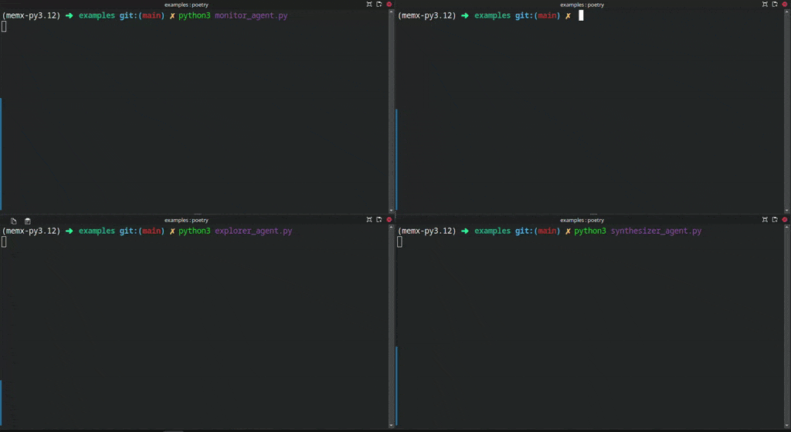

# memX: Shared Memory for Multi-Agent LLM Systems

memX is an open-source real-time shared memory layer built for agent-based LLM systems. It synchronizes structured state across agents with schema validation, access control, and pub/sub notifications backed by Redis and FastAPI.

## Table of Contents
- Overview
- Features
- How It Works
- Architecture
- Prerequisites
- Quickstart (Local)
- Run with Docker
- Configuration
- Python SDK
- HTTP API Examples
- Project Layout
- Development
- Contributing
- License

## Overview
Multi-agent workflows need a reliable way to share evolving context (state, goals, thoughts) without brittle controller logic. memX gives agents a simple, secure memory layer they can read and write in real time.

## Features
- Real-time memory synchronization over HTTP + WebSocket
- JSON Schema validation per key to keep data sane
- Fine-grained API keys via Supabase-backed records or local ACLs
- Pub/Sub notifications so agents can react instantly
- Python SDK (`memx-sdk`) with optional `MEMX_BASE_URL` override
- Docker-friendly for local or remote deployment

## How It Works
- FastAPI service exposes `set`, `get`, and schema endpoints; WebSocket subscriptions push updates.
- Redis stores last-write-wins payloads with timestamps for deterministic writes.
- API keys are resolved from a Supabase `api_keys` table when configured, otherwise from `config/acl.json`.
- The Python SDK wraps the HTTP/WebSocket interface and can be embedded directly in agents.

## Architecture
```
Agents / SDK
    |  HTTP (set/get/schema) + WS (subscribe)
    v
FastAPI app (main.py)
    |  access control via Supabase or config/acl.json
    |  schema validation (jsonschema)
    v
Redis (state + schemas)  <-- pub/sub notifications --> WebSocket clients
```

**Components**
- FastAPI: HTTP endpoints for reads/writes and schema management; WebSocket endpoint for subscriptions.
- validate_api: Supabase-backed API key lookups with local ACL fallback; enforces per-key scopes.
- Redis: authoritative store for values (with timestamps for last-write-wins) and schemas.
- pubsub: broadcasts updates to subscribed WebSocket clients when a value changes.
- Python SDK: thin client wrapping HTTP + WebSocket for easy agent integration; respects `MEMX_BASE_URL`.
- Docker stack: optional Redis + API bundle for local or remote deployment.

## Example: Collaborative Agents
Three autonomous agents coordinating on a research task:

| Agent              | Behavior                                             |
| ------------------ | ---------------------------------------------------- |
| `QueryAgent`       | Seeds the research question and background context   |
| `ExplorerAgent`    | Adds search results and working notes                |
| `SynthesizerAgent` | Summarizes the shared context into final insights    |
| `MonitorAgent`     | Logs real-time evolution of memory for observability |

All communication flows through shared keys in memX — not through chat or a controller.



## Prerequisites
- Python 3.12+
- Redis 7+ reachable at `REDIS_URL` (defaults to `redis://localhost:6379/0`)
- Poetry or pip for dependency installation
- Docker and docker-compose (optional)
- Supabase project + service key (optional) for centralized API key management

## Quickstart (Local)
1. Install dependencies:
   - `poetry install` (recommended), or `pip install -r requirements.txt`.
2. Start Redis if you do not already have one running:
   - `docker run --rm -p 6379:6379 redis:7-alpine`
3. Launch the API (runs on http://127.0.0.1:8000 by default):
   - `poetry run uvicorn main:app --reload --port 8000`
4. Use the bundled dev key `local_dev_key` from `config/acl.json` or add your own patterns there.
5. Try the sample script:
   - `poetry run python examples/test.py`
6. Open interactive docs at http://localhost:8000/docs.

## Run with Docker
- `docker-compose up --build` (or `make dev`) to start the API and Redis together.
- Set `SUPABASE_URL` and `SUPABASE_SERVICE_KEY` in your environment if you want Supabase-based key validation.
- Override `REDIS_URL` to point at an external Redis instance if desired (defaults to `redis://redis:6379/0` in compose).
- Stop the stack with `docker-compose down`.

## Configuration
### Environment variables
| Name | Default | Purpose |
| --- | --- | --- |
| `REDIS_URL` | `redis://localhost:6379/0` | Redis connection string for storing values and schemas. |
| `SUPABASE_URL` | unset | Supabase project URL used for API key lookup. |
| `SUPABASE_SERVICE_KEY` | unset | Supabase service role key for server-side lookups. |
| `MEMX_BASE_URL` | `http://127.0.0.1:8000` | Override host for the Python SDK and client requests. |

### API keys and ACLs
- When `SUPABASE_URL` and `SUPABASE_SERVICE_KEY` are set, the service reads from a Supabase `api_keys` table; records should include `key`, `active`, `scopes` (JSON with `read` and `write` patterns), and optional `user_id`.
- Without Supabase, memX falls back to `config/acl.json`, mapping API keys to glob-style patterns (for example, `"agent_key": ["agent:*"]`).
- Requests must send the API key in the `x-api-key` header for HTTP and WebSocket calls.

## Python SDK
Install from PyPI:
```bash
pip install memx-sdk
```

Basic usage:
```python
from memx_sdk import memxContext

ctx = memxContext(api_key="your_api_key")  # respects MEMX_BASE_URL or pass base_url=
ctx.set_schema("agent:goal", {
    "type": "object",
    "properties": {"x": {"type": "number"}, "y": {"type": "number"}},
    "required": ["x", "y"],
})
ctx.set("agent:goal", {"x": 1, "y": 7})
print(ctx.get("agent:goal"))
```

Subscribe to updates:
```python
def on_update(data):
    print("update:", data)

ctx.subscribe("agent:goal", on_update)
```

## HTTP API Examples
`x-api-key` header is required for all calls.

```bash
# Write a value (validates against schema if present)
curl -X POST "http://127.0.0.1:8000/set" \
  -H "x-api-key: local_dev_key" \
  -H "Content-Type: application/json" \
  -d '{"key":"agent:goal","value":{"x":1,"y":2}}'

# Read a value
curl -X GET "http://127.0.0.1:8000/get?key=agent:goal" \
  -H "x-api-key: local_dev_key"

# Register a schema
curl -X POST "http://127.0.0.1:8000/schema" \
  -H "x-api-key: local_dev_key" \
  -H "Content-Type: application/json" \
  -d '{"key":"agent:goal","schema":{"type":"object","properties":{"x":{"type":"number"},"y":{"type":"number"}},"required":["x","y"]}}'
```

## Project Layout
```
main.py             # FastAPI entrypoint and routes
store.py            # Redis-backed storage with last-write-wins semantics
schema.py           # Schema registration and validation helpers
pubsub.py           # WebSocket pub/sub bridge
validate_api.py     # API key enforcement via Supabase or local ACL
config/acl.json     # Sample local ACLs for development
examples/           # Agent integration demos
sdk/                # Python SDK source and packaging metadata
frontend/           # Streamlit UI experiments
Dockerfile          # Container image for the API
docker-compose.yml  # Dev stack (API + Redis)
```

## Development
- Use `poetry install` to create a virtualenv with dependencies, or `pip install -r requirements.txt`.
- Run the backend locally with `poetry run uvicorn main:app --reload`.
- The examples in `examples/test.py` and `sdk/memx_sdk/test_client.py` are the quickest way to exercise the API and SDK.
- Automated tests are not yet included; contributions that add coverage are welcome.

## Contributing
Issues and pull requests are welcome. Please open an issue to discuss larger changes, use feature branches for PRs, and keep updates focused with clear repro steps.

## License
memX is available under the MIT License (see `LICENSE`).
