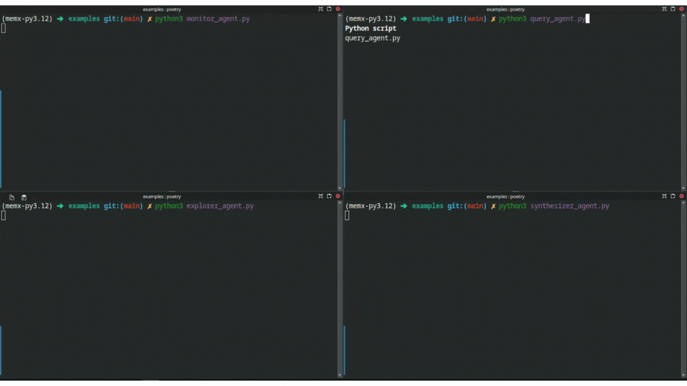

# 🧠 memX Context Store

A shared memory layer for multi-agent systems — with real-time sync, schema enforcement, and access control. Ideal for LLM agents, LangGraph, Autogen, robots, IoT, and more.

Think: **Redis + schema + pub/sub + ACL — purpose-built for agents.**

---

## 🚀 Features

* 🔄 Real-time context sync (WebSocket)
* 📬 Pub/sub updates on key change
* 📐 JSON Schema validation (per key)
* 🔐 API key-based access control
* 🐍 Python SDK (`context-sdk`) for easy integration
* 🐳 Docker-compatible self-hosting

---

## 📦 Quickstart

### ▶️ Install SDK

```bash
pip install context-sdk
```

### 💡 Usage Example

```python
from context_sdk import AgentContext

ctx = AgentContext(api_key="agent_key_1")
ctx.set("agent:goal", "navigate kitchen")
ctx.subscribe("agent:goal", lambda data: print("Goal:", data["value"]))
```

---

## ⚙️ Run the Server

### Option 1: Local Dev

```bash
uvicorn main:app --reload
```

### Option 2: Docker

```bash
docker-compose up --build
```

Visit: [http://localhost:8000/docs](http://localhost:8000/docs) for interactive Swagger UI.

---

## 🔑 Adding API Keys

Edit `config/acl.json`:

```json
{
  "agent_key_1": ["agent:*"],
  "planner_key": ["agent:goal"]
}
```

---

## 📐 Setting Schemas

```bash
POST /schema
Headers: x-api-key
Body:
{
  "key": "agent:state",
  "schema": {
    "type": "object",
    "properties": {"x": {"type": "number"}, "y": {"type": "number"}},
    "required": ["x", "y"]
  }
}
```

Or dynamically via SDK:

```python
ctx.set_schema("agent:state", schema_dict)
```

---

## 📁 Project Structure

```
core/       # FastAPI + WebSocket backend
sdk/        # Python SDK (installable)
config/     # Contains acl.json, (optionally schemas.json)
examples/   # Agent examples
```
## 🎬 Demo: Multi-Agent LLMs Using memX Shared Memory

3 LLM-style agents collaborate on a research task — without messaging each other or orchestration logic.

They use `memX` to share evolving memory in real time:

| Agent            | What it does                                     |
|------------------|--------------------------------------------------|
| `QueryAgent`     | Seeds the research question + background context |
| `ExplorerAgent`  | Adds search results + working thoughts           |
| `SynthesizerAgent` | Summarizes shared context into a final insight |
| `MonitorAgent`   | Logs how memory evolves in real time             |

> 💡 All communication happens *only* through shared keys in memX.


